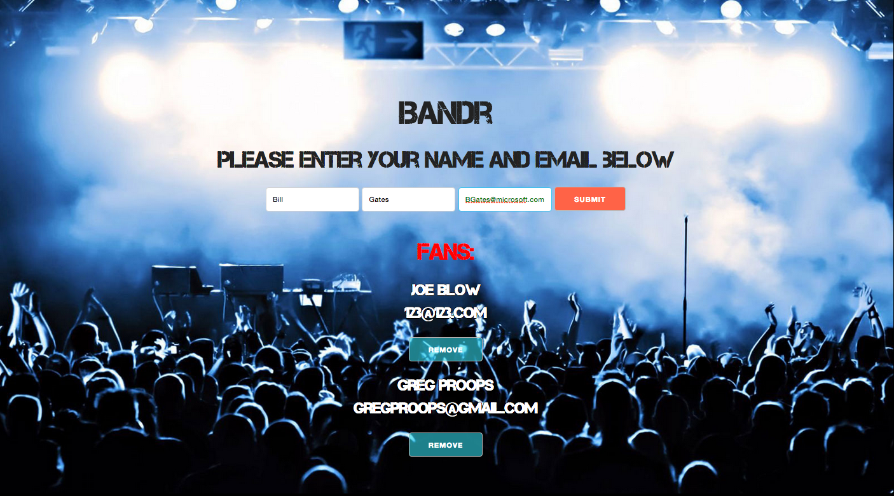

# Band_r

- Bandr is an email collection application for bands, built with Ruby and Sinatra on the backend, and Backbone.js on the frontend.

---

- Emails can only be submitted when a fan enters a valid email address.

---

---

##url

https://enigmatic-meadow-3782.herokuapp.com/

---

##Technologies

* Ruby
* Sinatra
* Backbone.js
* PostgreSQL
* Skeleton

***
